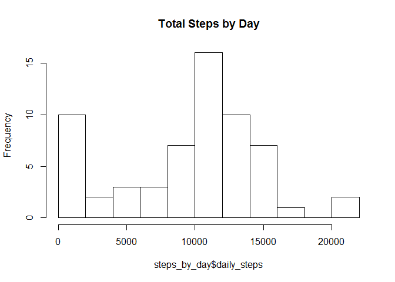
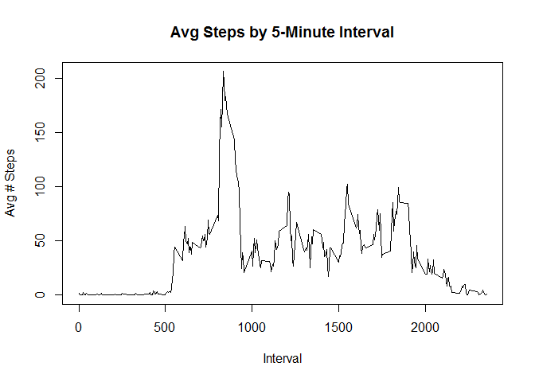
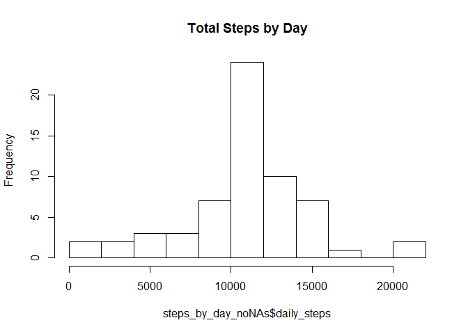
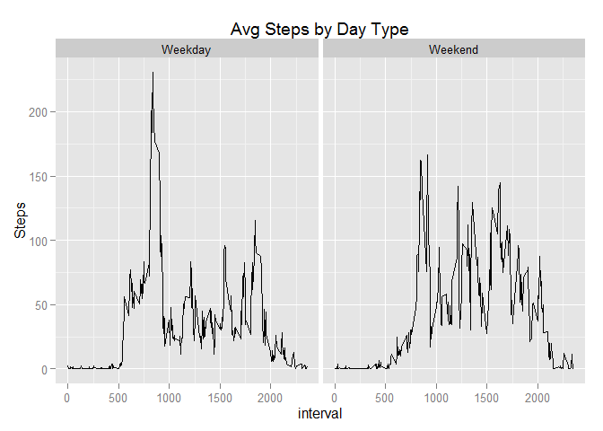

# Reproducible Research: Peer Assessment 1
###Tom Cecere
###May 17, 2015

## Loading and preprocessing the data

```r
## Code block #1 -- Read file and convert date to date format
setwd("C:/Users/DLeddy/Documents/GitHub/RepData_PeerAssessment1")
activity_df<-read.csv("./activity/activity.csv",colClasses=c("integer","character","integer"))
activity_df$date<-as.Date(activity_df$date, "%Y-%m-%d")
```

## What is mean total number of steps taken per day?

```r
library(dplyr)
```

```
## 
## Attaching package: 'dplyr'
## 
## The following object is masked from 'package:stats':
## 
##     filter
## 
## The following objects are masked from 'package:base':
## 
##     intersect, setdiff, setequal, union
```

```r
activity_by_day<- group_by(activity_df, date)
steps_by_day<-summarize(activity_by_day, daily_steps=sum(steps, na.rm=TRUE))

hist(steps_by_day$daily_steps, breaks=10, main="Total Steps by Day")
```

 

```r
print(paste("Median num steps per day: ", median(steps_by_day$daily_steps)))
```

```
## [1] "Median num steps per day:  10395"
```

```r
print(paste("Mean num steps per day: ", round(mean(steps_by_day$daily_steps),0)))
```

```
## [1] "Mean num steps per day:  9354"
```

## What is the average daily activity pattern?

```r
## Code block #3 -- Time series summary across intervals, Max interval
activity_by_interval<- group_by(activity_df, interval)
steps_by_interval<-summarize(activity_by_interval, int_steps=round(mean(steps, na.rm=TRUE),1))
plot(steps_by_interval$interval, steps_by_interval$int_steps, type="l", ylab="Avg # Steps", xlab="Interval", main="Avg Steps by 5-Minute Interval")
```

 

```r
print(paste("Interval with highest avg num steps: ", steps_by_interval$interval[steps_by_interval$int_steps==max(steps_by_interval$int_steps)]))
```

```
## [1] "Interval with highest avg num steps:  835"
```

## Imputing missing values

```r
##Code block #4a -- Calculate # of NAs, substitute interval mean for NAs
tot_nas<-sum(is.na(activity_df$steps))
print(paste("Total NAs = ", tot_nas))
```

```
## [1] "Total NAs =  2304"
```


```r
activity_noNAs<-activity_df
for (i in 1:length(activity_noNAs$steps)) {
     if(is.na(activity_noNAs$steps[i])) {
          activity_noNAs$steps[i]<-steps_by_interval$int_steps[steps_by_interval$interval==activity_noNAs$interval[i]]
     }
}

##Code block 4b -- Redo histogram, mean, medium on new data
activity_by_day_noNAs<- group_by(activity_noNAs, date)
steps_by_day_noNAs<-summarize(activity_by_day_noNAs, daily_steps=sum(steps, na.rm=TRUE))

hist(steps_by_day_noNAs$daily_steps, breaks=10, main="Total Steps by Day")
```

 

```r
print(paste("Median num steps per day: ", median(steps_by_day_noNAs$daily_steps)))
```

```
## [1] "Median num steps per day:  10766.2"
```

```r
print(paste("Mean num steps per day: ", round(mean(steps_by_day_noNAs$daily_steps),0)))
```

```
## [1] "Mean num steps per day:  10766"
```

```r
c1<-c("Mean", "Median")
c2<-c(median(steps_by_day$daily_steps), round(mean(steps_by_day$daily_steps),0))
c3<-c(median(steps_by_day_noNAs$daily_steps), round(mean(steps_by_day_noNAs$daily_steps),0))
comparison<-cbind(c2, c3)
rownames(comparison)<-c1
colnames(comparison)<-c("Original", "NAs Removed")
print(comparison)
```

```
##        Original NAs Removed
## Mean      10395     10766.2
## Median     9354     10766.0
```
## Are there differences in activity patterns between weekdays and weekends?

```r
##Code segment #5a -- Weekend vs. Weekday, then get interval means
activity_noNAs$day<-weekdays(as.POSIXlt(activity_noNAs$date))
activity_noNAs$workweek<-"Weekday"
wkend_days<-c("Saturday", "Sunday")
activity_noNAs$workweek[activity_noNAs$day %in% wkend_days] <- "Weekend"
activity_noNAs$workweek<-as.factor(activity_noNAs$workweek)

activity_by_interval_noNAs<- group_by(activity_noNAs, interval, workweek)
steps_by_interval_noNAs<-summarize(activity_by_interval_noNAs, int_steps=round(mean(steps, na.rm=TRUE),1))

##Code segment #5b -- plot with factors
library(ggplot2)

h<-qplot(interval, int_steps, data=steps_by_interval_noNAs, facets=.~workweek, geom="line", ylab="Steps", main="Avg Steps by Day Type") 
h
```

 
